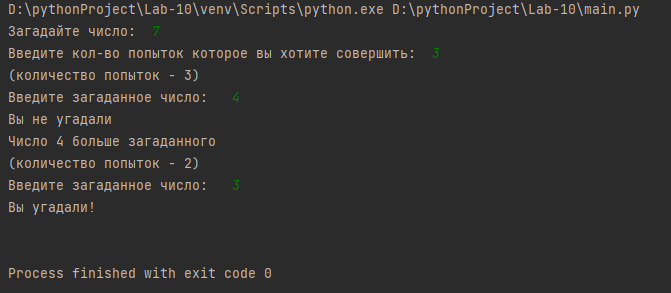
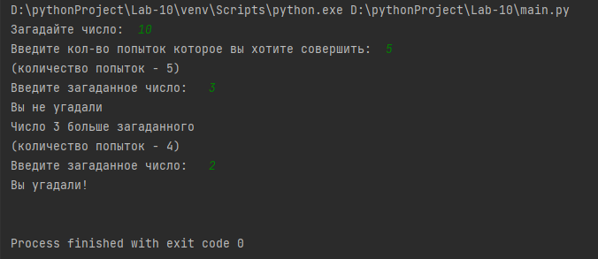

# Lab-10 
# Создатель 
Лада Александр Фт-220007
# Функционал программы 
Компьютер загадывает число от 1 до N. У пользователя k попыток отгадать. После каждой неудачной попытки компьютер сообщает меньше или больше загаданное число. В конце игры текст с результатом (или «Вы угадали», или «Попытки закончились»).
# Запуск программы 
Программа может быть открыта в любой среде.
Написана в VScode
# Входные данные
Натуральные числа N и k.
# Выходные данные
Ответ на попытку ввода, ответ в конце игры.
# Тесты ️
Тест 1 (N=7, K=3)
___

___
Тест 2 (N=10, K=5)
___

___
